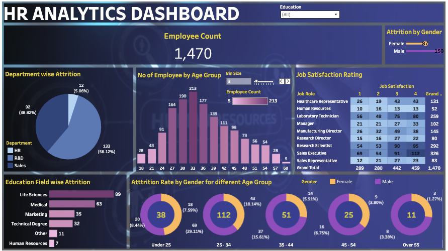

# HR Analytics Dashboard

## Project Overview

In the dynamic landscape of modern human resources, understanding the factors that contribute to employee attrition is crucial for organizational stability and growth. This project presents a comprehensive **HR Analytics Dashboard** designed to uncover the underlying patterns of employee turnover and provide actionable insights for retention strategies.

Leveraging **Tableau** for data visualization, this project transforms raw HR data into a compelling narrative about the workforce. The analysis focuses on identifying high-risk demographics and departments, allowing HR leaders to move from reactive measures to proactive talent management.

## Dashboard Screenshot

## Tableau Public Link

[View the Interactive Dashboard](https://public.tableau.com/views/HRDataAnalytics_17374684617830/HRAnalyticsDashboard?:language=en-US&:sid=&:redirect=auth&:display_count=n&:origin=viz_share_link)

## Business Intelligence & Data Storytelling

The core objective of this analysis is to answer critical business questions regarding workforce stability. By dissecting attrition rates across various dimensions, this dashboard provides a clear view of "who" is leaving and potential indicators of "why."

### Key Areas of Analysis

The dashboard breaks down attrition through several critical lenses:

*   **Demographic Analysis**:
    *   **Attrition by Gender**: Examining if turnover rates skew towards a specific gender to ensure inclusive retention policies.
    *   **Age Group Dynamics**: analyzing the relationship between employee age and attrition, helping to tailor engagement strategies for different generational cohorts (e.g., Early Career vs. Tenured).

*   **Organizational Drivers**:
    *   **Departmental Trends**: Pinpointing which departments face the highest churn, allowing for targeted interventions in management or workload distribution.
    *   **Education Field Correlation**: Understanding if employees with specific educational backgrounds are more prone to leaving, which can inform recruitment strategies.

*   **Employee Sentiment**:
    *   **Job Satisfaction Ratings**: Correlating reported satisfaction levels with retention to validate the impact of employee engagement initiatives.

## Dashboard Highlights

The project includes the following visualizations:

1.  **KPI Overview**: A high-level summary of total employees, active workforce, and overall attrition metrics.
2.  **Attrition by Gender**: A comparative view of turnover distribution between male and female employees.
3.  **Attrition Rate by Age Group**: A deep dive into how attrition probabilities shift across different age bands.
4.  **Department-wise Attrition**: A breakdown of turnover impact across business functions (R&D, Sales, HR).
5.  **Education Field Analysis**: Insights into retention rates based on academic backgrounds like Life Sciences and Medical.
6.  **Job Satisfaction Matrix**: Visualizing the complex relationship between employee happiness scores and their decision to leave.

## Key Insights & Findings

Analysis of the dataset reveals several critical trends relevant to workforce stability:

*   **Overall Attrition & Demographics**:
    *   The organization faces a **16.12% attrition rate** (237 exits out of 1,470).
    *   **High Risk Zone**: The **26-35 age group** is the most volatile, contributing to **116** of the exits (nearly 50%). Strategies for career progression should target this specific cohort.
    *   **Gender Dynamics**: While more men left in absolute numbers (150 vs 87), this likely reflects the underlying workforce composition.

*   **Departmental & Educational Drivers**:
    *   **R&D** and **Sales** are the primary friction points, with **133** and **92** exits respectively.
    *   The high turnover in **Life Sciences** and **Medical** education fields correlates strongly with the R&D attrition, suggesting industry-wide demand for these skills might be pulling talent away.

*   **The "Satisfaction Paradox"**:
    *   Counter-intuitively, retention is not guaranteed by "High" job satisfaction.
    *   **73 employees** with "High" satisfaction ratings left the company, compared to only **66** with "Low" ratings.
    *   **Strategic Implication**: High satisfaction scores may mask other issues (e.g., lack of growth, salary competitiveness). Retention efforts must go beyond "keeping employees happy" to "keeping employees growing and compensated."

## Tools & Technologies

*   **Tableau**: Used for end-to-end data visualization, dashboarding, and interactivity.
*   **Data Analysis**: Exploratory Data Analysis (EDA) to clean, validate, and structure the dataset for optimal reporting.

## Conclusion

This project reflects a deep passion for transforming data into strategic assets. By visualizing the complexities of human capital, we can better understand the "human" side of Human Resources. The insights derived from this dashboard serve as a foundation for data-driven decision-making, ultimately fostering a more resilient and engaged workforce.

## Author
Shubham Kulkarni